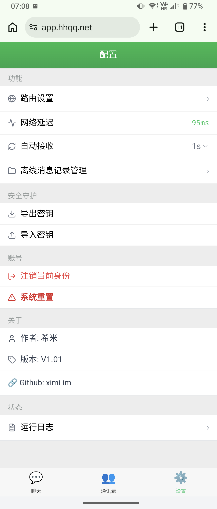
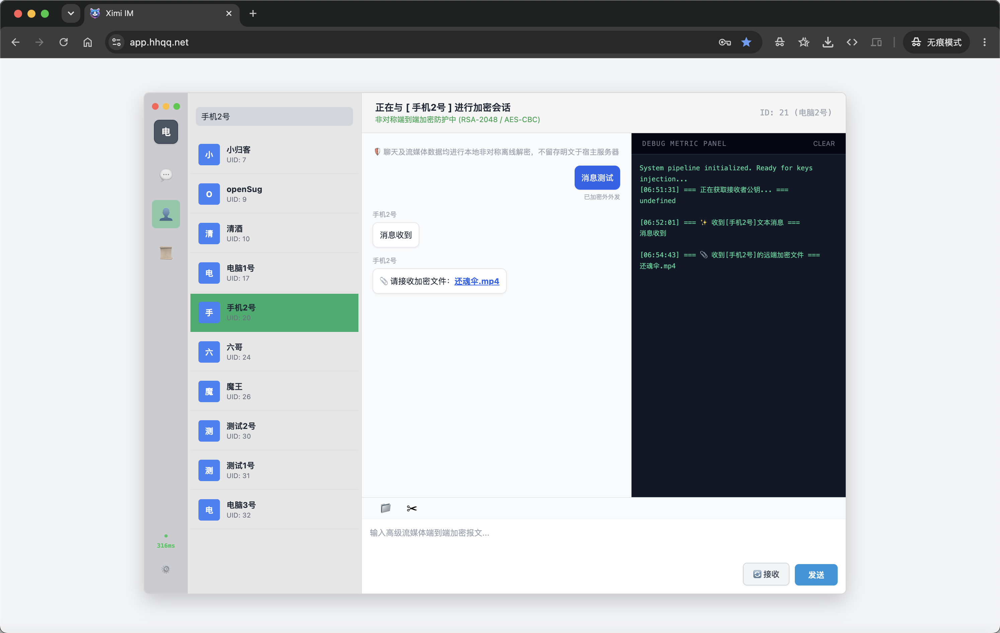
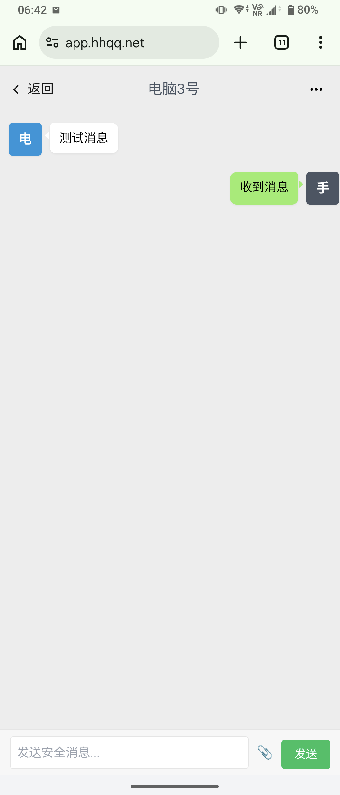

# 💬 ximi IM(希米密聊)

<p align="center">
   
  
  
    
  
</p>

<p align="center">
  一个基于 <b>端到端加密（E2EE）+ 阅后即焚机制</b> 的极简安全聊天系统, 轻量部署·无依赖架构· PHP + SQLite 单文件运行

<p align="center">
  🌐 <a href="https://app.hhqq.net/">在线演示预览</a> | 📝 <a href="https://www.ximi.me/post-6043.html">官方博客发布页</a>
</p>


---

## ✨ 项目特性

### 🔐 隐私与安全
- 端到端加密通信（RSA-2048 + AES-CBC 混合加密）
- 服务端仅存储密文，无法解密任何聊天内容
- 阅后即焚机制：消息被读取后立即销毁，不留痕迹
- 无聊天记录持久化设计

### 📁 文件传输
- 支持大文件分片上传
- 本地 AES 加密（`.enc` 格式）
- 服务端仅作为中转缓存
- 客户端内存级解密还原

### 🛡️ 安全防护
- 文件上传白名单机制
- 异常访问上传自动拉黑
- IP 自动黑名单系统（异常 JS 行为触发封禁）
- 前端异常操作检测机制

### ⚙️ 架构特点
- 零依赖部署（无 Redis / Node.js / Docker）
- 仅需 PHP + SQLite3
- 使用路由api方式访问,客户端可单机自行定制
- 适配虚拟主机 / 轻量服务器

### 🧩 管理后台
- 用户管理（封禁 / 修改 / 删除）
- 消息队列监控
- 文件上传通道开关
- 一键清理系统数据

---

## 📸 界面预览

| 手机界面 | PC界面 | 手机界面 |
|----------|----------|----------|
|  |  |  |

---

## 🛠️ 技术栈

- 前端：HTML + JavaScript
- 后端：PHP（原生）
- 数据库：SQLite3（单文件）

---

## 🚀 快速开始

### 1. 上传至服务器
   将项目所有文件上传至你的 Web 站点根目录（如 wwwroot/im）。
   或是克隆仓库代码
```bash
git clone https://github.com/xm-nas/ximi-im.git
```

### 2. 设置目录权限
   确保以下目录/文件对 Web 服务器进程（如 www-data）拥有可写权限：

```Bash
chmod -R 755 uploads/
```
### 3. 一键部署

 - 当服务器支持curl扩展,可直接运行单文件`install.php`安装向导,点击一键修复会自动下载所需文件,完成安装部署;
 - 前台访问即会自动执行安装向导,数据库路径名称可留空,系统自动生成更安全;
 - 安装向导会自行检测安装环境是否符合要求,符合要求点一键安装自动完成配置信息;
 - 首次进入后台会提示设置后台登陆密码,后续使用该密码登陆后台即可;
 - 安装完成后建议删除install.php

## ⚙️ 后台管理

访问你的管理入口（如 https://yourdomain.com/admin.php）， 输入密码即可进入可视化运维中心：

- 用户管理：快速修改昵称、密码，或强制开除异常用户（自动连带销毁其所有滞留消息）。

- 消息队列：全局视角审阅当前服务器积压的密文，支持一键物理清空。

- 系统设置：支持一键开启/关闭全站文件上传通道。

## 📂 目录结构说明
```Plaintext
/ximi-im
├── api.php           # 核心业务接口 (鉴权、收发、安全防御)
├── admin.php         # 独立的可视化运维后台面板
├── install.php       # 自动安装向导
├── db.php            # SQLite 数据库连接及初始化逻辑
├── index.html        # 前台 IM 交互界面
├── web.js            # 前端Mobile页面相关加密算法库
├── ximi.js           # 前端pc页面相关加密算法库
├── crypto-js.min.js  # 前端AES加密库
├── uploads/          # 加密文件缓冲目录 (自动生成并清理)
├── blacklist.json    # 动态 IP 防御黑名单
└── README.md         # 项目文档
```
## 📅 版本与关于

* 当前版本：V1.11 (Stable)

* 更新日期：2026.06.25

* 作者：ximi

* 项目主页：[Ximi's Blog](https://www.ximi.me/post-6043.html)

##  ⚠️ 免责声明
本项目仅供技术学习与交流探讨使用。请在遵守当地法律法规的前提下使用本软件。开发者不对因非法使用本软件而产生的任何直接或间接后果负责。

##  📄 协议
本项目基于 MIT License 开源，保留本声明即可自由修改与分发。
